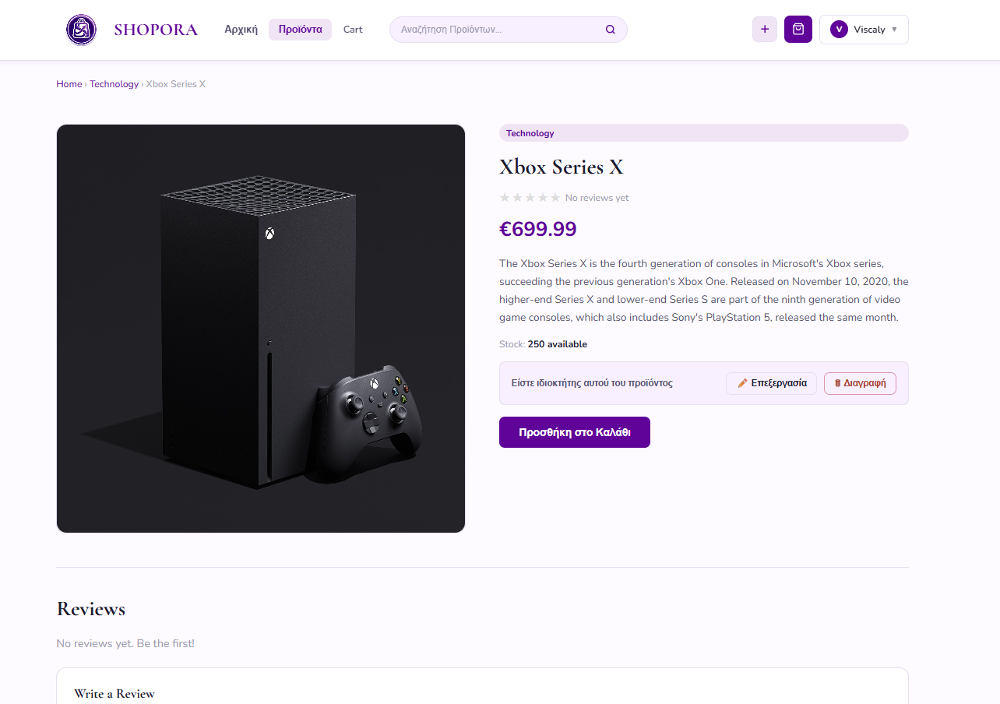
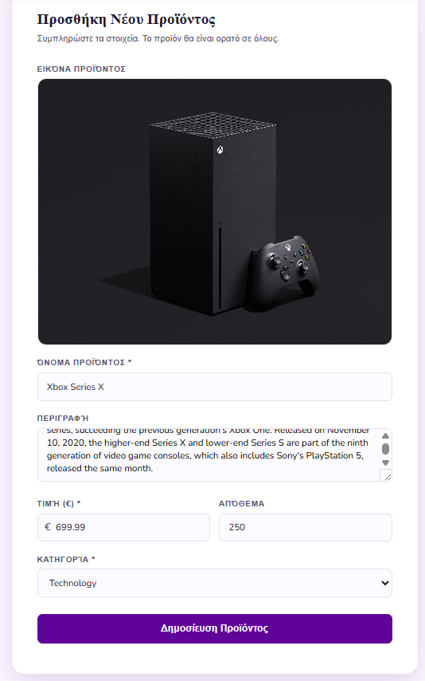
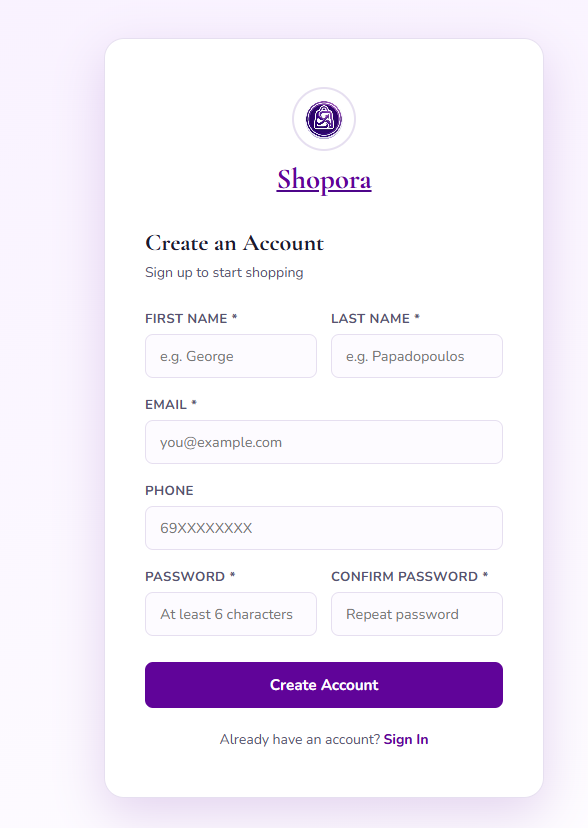
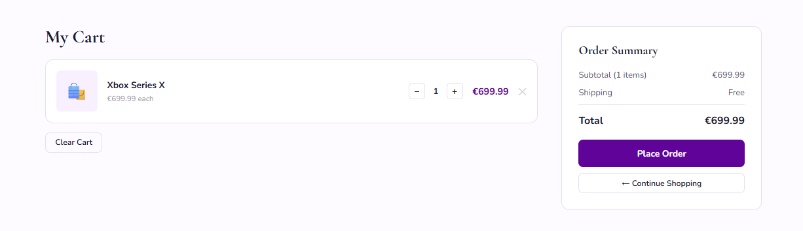

# 🛍️ Shopora

**Shopora** is a full-stack e-commerce demo built with PHP and MySQL. Customers can register, browse products by category, add items to a persistent shopping cart, leave star ratings and reviews, and manage their accounts.

---

## ✨ Features

| Feature | Details |
|---|---|
| 👤 Authentication | Register, login, logout with PHP session management |
| 🏠 Home Page | Company presentation, live stats, featured products by avg rating |
| 🛍️ Product Catalogue | Browse all products, filter by category, search by name |
| 📄 Product Page | Full details, image, stock, star rating, reviews and discussion |
| ⭐ Reviews | Rate products 1–5 stars with a written comment (one per user) |
| 💬 Comments | Leave discussion comments on any product page |
| 🛒 Shopping Cart | Persistent DB-backed cart — survives logout and login |
| ➕ Add Product | Logged-in users can upload products with image, price, stock, category |
| ✏️ Edit Product | Product owners can edit their own listings inline |
| 🗑️ Delete Product | Product owners can delete their listings (image removed from disk) |
| 👤 Edit Account | Update name, email, password and upload a profile avatar |
| 🗑️ Delete Account | Permanently deletes account, products, cart, reviews and comments |
| 🖼️ Image Upload | Product images and user avatars uploaded and stored locally |

---

## 🛠️ Tech Stack

- **Frontend:** HTML, CSS, JavaScript
- **Backend:** PHP 8+
- **Database:** MySQL via phpMyAdmin
- **Server:** Apache (XAMPP)

---

## 📁 Project Structure

```
Shopora/
├── index.php               # Home page — hero, company info, featured products
├── navbar.php              # Shared navbar included on every page
├── style.css               # Main stylesheet (all pages)
│
├── products/
│   ├── products.php        # All products with category tabs and search
│   ├── product.php         # Single product — details, reviews, comments
│   ├── add_product.php     # Upload a new product (auth required)
│   ├── edit_product.php    # Manage & edit own products
│   └── remove_product.php  # Delete a product (owner only)
│
├── account/
│   ├── login.php           # Sign-in page
│   ├── register.php        # Sign-up page
│   ├── logout.php          # Session destroy + redirect
│   ├── edit_account.php    # Edit name, email, password, avatar
│   ├── delete_account.php  # Permanently delete account
│
├── cart/
│   └── cart.php            # Shopping cart (DB-backed, persistent)
│
├── database/
│   └── db.php              # DB connection + session helper
│
└── images/
    ├── shopora.webp         # Brand logo
    ├── products/            # Uploaded product images
    └── avatars/             # Uploaded user avatars
```

---

## 🗄️ Database Schema

**Database name:** `shopora_db`

| Table | Columns |
|---|---|
| `customers` | user_id, first_name, last_name, email, password, phone, avatar, created_at |
| `products` | product_id, owner_id, name, description, price, stock, category, image_path, created_at |
| `cart` | cart_id, user_id, product_id, quantity, added_at |
| `reviews` | id, product_id, customer_id, vathmologia (1–5), sxolio, created_at |
| `comments` | id, product_id, customer_id, body, created_at |

> `owner_id` in `products` references `customers.user_id` with `ON DELETE CASCADE` — deleting a customer removes all their products automatically.

---

## ⚙️ Installation

1. **Clone the repository**
   ```bash
   git clone https://github.com/viscaly/Shopora.git
   ```

2. **Move to XAMPP**
   ```
   C:\xampp\htdocs\Shopora\
   ```

3. **Create the database**
   - Open phpMyAdmin → create database `shopora_db`
   - Import `shopora.sql` (includes all table definitions)

4. **Configure DB connection**
   - Edit `database/db.php`:
   ```php
   define('DB_USER', 'root');
   define('DB_PASS', '');
   define('DB_NAME', 'shopora_db');
   ```

5. **Create image folders**
   ```
   Shopora/images/products/
   Shopora/images/avatars/
   ```

6. **Start Apache & MySQL** in XAMPP and visit:
   ```
   http://localhost/Shopora/
   ```

---

## 📸 Screenshots

> Add screenshots of your pages here.

| Home | Products | Product Detail |
|------|----------|----------------|
|  |  |  |

| Sign In | Register | Cart |
|---------|----------|------|
|  |  |  |

---

## 🔐 Security Notes

- Passwords are hashed with `password_hash()` (bcrypt) — never stored in plain text
- All user input is sanitised with `real_escape_string()` before DB queries
- Product edit and delete operations verify `owner_id` server-side — no client-side trust
- Account deletion requires current password confirmation before any data is removed
